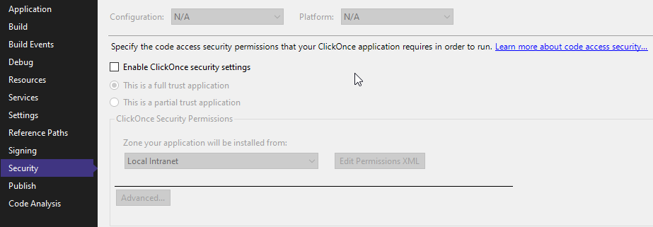
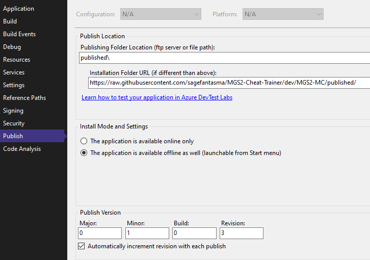

If a proper CI/CD pipeline is too much/difficult to implement, we CAN use ClickOnce. Here's how it would be accomplished:

1. Right Click on **Project**, select "Properties".

2. Under **Signing**: Verify "Sign the ClickOnce manifests" is unchecked.

3. Under **Security**: Verify "Enable ClickOnce security settings" is disabled.

4. Under **Application**: Make sure to update your assembly version & file version, especially if you are leveraging debuglogs.

5. Under **Publish**: 
	1. Set *Publishing Folder Location (ftp server or file path):* to a ***relative local path to build the application to***.
	2. Set *Installation Folder URL(if different than above):* to the ***raw github link for the MAIN publishing folder***.
	
	3. You may also be interested in some other minor settings on this page, explore at your discretion.
	4. Click on *Publish Now*.
	5. After the publish has completed, commit and push the build. 
	
	
Now, when the user who has installed your application from the **setup.exe** file in the *Installation Folder URL* folder next launches their application, their application will automatically update to the latest version available before launch!

Each individual version you publish will appear in sub-folders within `<PublishingFolderLocation>/Application Files` on Github if you need to distribute/access specific versions.